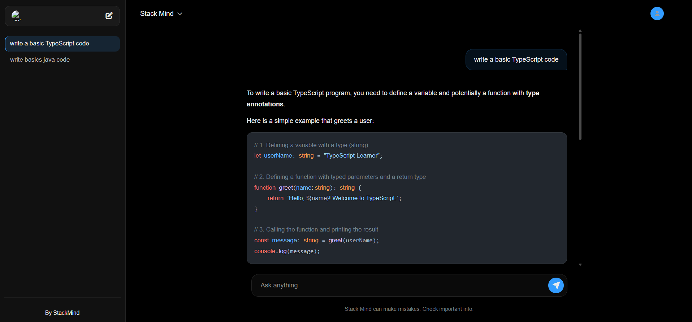

# 🧠 StackMind

A simple AI chatbot built with the MERN stack (MongoDB, Express, React, Node) and the Google Gemini API, made to practice full-stack development.

🔗 [Live Demo](https://stack-mind-dusky.vercel.app/)


---

## Screenshot



---

## Features

- Sign up / log in (JWT auth)
- Chats saved as separate threads
- AI replies from Google Gemini with a typing animation
- Markdown + code block rendering
- Delete old threads

---

## Tech Stack

**Frontend:** React, Vite, Context API, react-markdown, rehype-highlight

**Backend:** Node.js, Express, MongoDB + Mongoose, JWT, bcrypt

**AI:** Google Gemini API (`gemini-2.5-flash`)

---

## Project Structure

```
StackMind/
├── Backend/
│   ├── middleware/
│   ├── models/
│   ├── routes/
│   ├── utils/
│   └── server.js
├── Frontend/
│   └── src/
│       ├── components/
│       ├── App.jsx
│       ├── Chat.jsx
│       ├── ChatWindow.jsx
│       ├── Sidebar.jsx
│       └── MyContext.jsx
└── README.md
```

---

## Setup

**1. Clone**
```bash
git clone https://github.com/vivekkr620/StackMind.git
cd StackMind
```

**2. Backend**
```bash
cd Backend
npm install
```
Create a `.env` file:
```
MONGODB_URL=your_mongodb_connection_string
GEMINI_API_KEY=your_gemini_api_key
JWT_SECRET=any_random_string
PORT=8080
```
```bash
npm start
```

**3. Frontend**
```bash
cd Frontend
npm install
npm run dev
```

App runs at `http://localhost:5173`, backend at `http://localhost:8080`.

---

## API Routes

| Method | Route | Description |
|---|---|---|
| GET | `/api/thread` | Get all threads for logged-in user |
| GET | `/api/thread/:threadId` | Get messages in a thread |
| POST | `/api/chat` | Send a message, get AI reply |
| DELETE | `/api/thread/:threadId` | Delete a thread |

---

## To-Do

- [ ] Mobile responsiveness
- [ ] Dark mode
- [ ] Search threads
- [ ] Rate limiting
- [ ] Docker setup

---

⭐ Feel free to star if this was useful.
